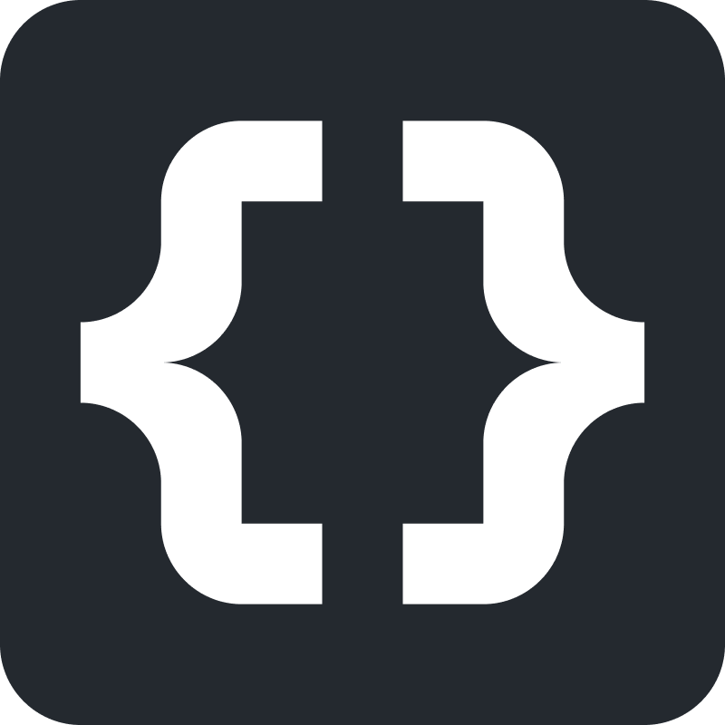

<div align="center">
<a href="https://victoreke.com"></a>
</div>

<div align="center">
<h1>victoreke.com</h1>
<p>My personal portfolio website</p>
</div>

# Tech Stack

- [NextJS][nextjs] - UI framework
- [Vercel][vercel] - Hosting and Deployment
- [Sanity.io][sanity]: Headless CMS and Content Lake
- [TailwindCSS][tailwind] / CSS - Styling and UI
- [Umami][umami]: Analytics
- [Next Themes][nexttheme]: Color Theme
- [React Refractor][reactrefractor]: Syntax Highlighting

## Project Overview

| [Site][site]          | [Studio][studio]                 |
| --------------------- | -------------------------------- |
| ![Site][site-preview] | ![Sanity Studio][studio-preview] |

## Run Project Locally

Follow this guide to get this site runnning locally:

### Clone Repository

```js
git clone https://github.com/Evavic44/victoreke.com.git

cd victoreke.com

npm install
```

- Rename [`.env.example`][env-example] to `.env.local`

### Get Env variables

The minimal `env` variables required to boot this project locally includes:

- `Project Id`
- `Dataset`
- `API Version`
- `Access Token`

These variables come from Sanity. To get them, you need to setup your own Sanity instance. Follow the steps below to do this:

### Create a new sanity project

Run the command below in a terminal to create a new Sanity project:

```js
npm create sanity@latest -- --template clean --create-project "John Doe" --dataset production
```

- **Create an account**: If you already have a Sanity account, this will automatically connect to it, if not, select a login provider from the list of options, hit `Enter` and follow the prompt to create one.
- **Choose an Output path**: Hit the `Enter` key to select the default path.
- Install the dependencies with your preferred package manager

Once completed open up the studio directory.

```js
cd john-doe

code .
```

- Navigate to the `sanity.config.ts` file in the root directory and copy the `projectId`. Now you can close the studio file.

### Update Env Variables

Open up the cloned repository and do the following:

- Set `NEXT_PUBLIC_SANITY_PROJECT_ID` to the project id you copied earlier
- Set `NEXT_PUBLIC_SANITY_DATASET` to `production` or the dataset name you used.
- Set `NEXT_PUBLIC_SANITY_API_VERSION` to your current date in **YYYY-MM-DD** format or leave as is
- If you want to use an access token, visit [sanity.io/manage][sanity-manage] > **project name** > **API** > **Token** to create one. Once generated, copy the token and set it to `NEXT_PUBLIC_SANITY_ACCESS_TOKEN`.

> [!Warning]
> If you don't want to use a token, comment it out in the [env.api.ts][env-api] file or else it will throw errors.

- Now run `npm run dev` and you can visit [http://localhost:3000][localhost] to see the project live.

By default the UI will be blank. To start adding data to the site, visit your studio at [http://localhost:3000/studio][localhost-studio] to create your own documents.

If you expereinced any issues or enquiries, please raise an issue to discuss it.

## Additional Information

Need more guidiance, check out this [tutorial][sanity-guide] that provides a step-by-step guide to setting up Sanity studio for your portfolio site.

## Build

```bash
npm run build
```

### Important files and folders

| File(s)                                        | Description                                     |
| ---------------------------------------------- | ----------------------------------------------- |
| [`sanity.config.ts`](sanity.config.ts)         | Config file for Sanity Studio                   |
| [`sanity.client.ts`](lib/sanity.client.ts)     | Config file for Sanity CLI                      |
| [`studio`](./app/studio/[[...index]]/page.tsx) | Where Sanity Studio is mounted                  |
| [`schemas`](./schemas)                         | Where Sanity Studio gets its content types from |
| [`sanity.query.ts`](./lib/sanity.query.ts)     | Groq query for Sanity Schema data               |

## License & Usage

This portfolio is MIT-licensed so you are free to use it as an inspiration or you can just copy the whole thing (excluding my personal content of course), I don't really mind. Just make sure you link back to [victoreke.com][site] on the footer section as attribution to the original source.

<!-- Link Refs -->

[nextjs]: https://nextjs.org
[vercel]: https://vercel.com
[sanity]: https://sanity.io
[tailwind]: https://tailwindcss.com
[umami]: https://umami.is
[planetscale]: https://planetscale.com/
[nexttheme]: https://github.com/pacocoursey/next-themes
[reactrefractor]: https://github.com/rexxars/react-refractor
[site]: https://victoreke.com
[studio]: https://victoreke.com/studio
[studio-preview]: https://github.com/Evavic44/victoreke.com/assets/62628408/a2574479-a352-4437-ba67-14bd976e48eb
[site-preview]: https://github.com/Evavic44/victoreke.com/assets/62628408/e84ac72f-1ba1-4c46-bfc0-2512ffa0e5fa
[env-example]: https://github.com/Evavic44/victoreke.com/blob/main/.env.example
[localhost]: http://localhost:3000
[localhost-studio]: http://localhost:3000/studio
[env-api]: https://github.com/Evavic44/victoreke.com/blob/main/lib/env.api.ts
[sanity-manage]: https://sanity.io/manage
[sanity-guide]: https://www.freecodecamp.org/news/how-to-build-a-portfolio-site-with-sanity-and-nextjs
